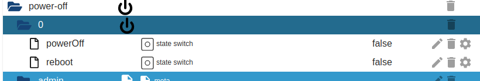
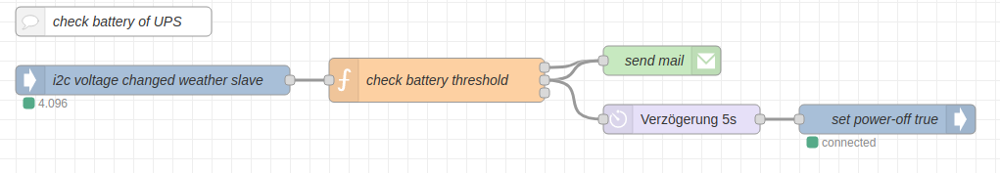

[](https://www.npmjs.com/package/iobroker.power-off)
[](https://www.npmjs.com/package/iobroker.power-off)


[](https://nodei.co/npm/iobroker.power-off/)

## power-off adapter for ioBroker

Allows to power off your linux box.

This adapter was created to shutdown a slave-host on low battery level of its UPS (Uninterruptible Power Supply).

For restarting the adapter either executes "sudo poweroff" or "sudo reboot". Your user under which iobroker is running (by default "iobroker") needs to have sudo rights to those two commands.

edit the sudo rules with
```
sudo visudo
```

Adding this line will allow the user iobroker reboot and poweroff
```
iobroker ALL=(ALL) NOPASSWD: /sbin/poweroff, /sbin/reboot
```

## Example Usage

Setting one of these switched to true shuts the host down or reboots.


Example UPS monitoring via node-red. Sending notifications when battery gets low and shutting host when getting below a minimal threshold:


Example script used in node-red monitoring:

``` Javascript
const emailPercThreshold = 70;
const shutDownPercThreshold = 20;
const msBetweenMails = 1000*60*30;
const now = new Date().getTime();

msg.bus_voltage = parseFloat(msg.payload);
msg.batteryPerc = Math.min(100,Math.max((msg.bus_voltage - 3)/1.2*100));

if (msg.batteryPerc < shutDownPercThreshold) {
    msg.topic = `iobrokerwheather shutting down, UPS only ${Math.round(msg.batteryPerc)}% battery remaining`;
    msg.payload = true;
    return [null, msg, msg];
}
else if (msg.batteryPerc < emailPercThreshold) {
    const lastMsgTime = flow.get("iobrokerwheatherLastMsg");
    if (lastMsgTime !== undefined && now - lastMsgTime < msBetweenMails) {
        return;
    }
    
    msg.topic = `iobrokerwheather, UPS only ${Math.round(msg.batteryPerc)}% battery remaining`;
    flow.set("iobrokerwheatherLastMsg", now);
    return [msg, null, msg];
}

return [null, null, msg];
```

## Changelog
### **WORK IN PROGRESS**

- "Example Usage" with screenshots and scripts added to readme 

### 1.0.3 (2022-01-22)

- Sentry disabled from release script

### 1.0.2 (2022-01-22)

- Fiddeling around to get stuff auto-deployed on npm

### 1.0.1 (2022-01-22)

- package-lock.json removed from git-ignore

### 1.0.0 (2022-01-22)

- first working release

## License
MIT License

Copyright (c) 2022 Daniel Keller <jobe451@gmail.com>

Permission is hereby granted, free of charge, to any person obtaining a copy
of this software and associated documentation files (the "Software"), to deal
in the Software without restriction, including without limitation the rights
to use, copy, modify, merge, publish, distribute, sublicense, and/or sell
copies of the Software, and to permit persons to whom the Software is
furnished to do so, subject to the following conditions:

The above copyright notice and this permission notice shall be included in all
copies or substantial portions of the Software.

THE SOFTWARE IS PROVIDED "AS IS", WITHOUT WARRANTY OF ANY KIND, EXPRESS OR
IMPLIED, INCLUDING BUT NOT LIMITED TO THE WARRANTIES OF MERCHANTABILITY,
FITNESS FOR A PARTICULAR PURPOSE AND NONINFRINGEMENT. IN NO EVENT SHALL THE
AUTHORS OR COPYRIGHT HOLDERS BE LIABLE FOR ANY CLAIM, DAMAGES OR OTHER
LIABILITY, WHETHER IN AN ACTION OF CONTRACT, TORT OR OTHERWISE, ARISING FROM,
OUT OF OR IN CONNECTION WITH THE SOFTWARE OR THE USE OR OTHER DEALINGS IN THE
SOFTWARE.